[中文](README.md) | [English](README.en.md)

# TalkDesk 语音聊天与房间管理系统 · WebRTC / Java 21 / Spring Boot / Vue 3

**知华科技（上海如静知华信息科技有限公司）** · [官网](https://www.zhuatech.cn/)

TalkDesk 是可自行部署的多人语音与文字聊天源码系统，面向团队协作、游戏或兴趣社群，以及需要集成自有账号和语音房间的业务系统。浏览器进入房间，文字消息保存在 MySQL，音频通过客户自部署的 LiveKit 服务传输；知华不提供公众通信平台或托管语音账号。

**公开源码学习版／非商业源码版。** 仅限个人学习、技术研究和非商业交流；未经上海如静知华信息科技有限公司书面授权不得商用。不是允许免费商用的 OSI 开源许可，详见 [LICENSE](LICENSE)。商业授权不替代第三方组件许可，也不包含网站/APP及通信业务运营资质。

## 一次实际使用流程

1. 管理员创建组织、角色和登录账号。空库只有管理员，不自动生成客户聊天或共享测试账号。
2. 成员创建私有或组织房间，设置分类、说明与人数上限。同组织有效成员可发现组织房；私有房通过限期、限次邀请加入。
3. 成员发送持久文字消息、读取历史；本人或房间管理者可移除正文，保留移除标记。
4. 点击加入语音时默认静音，明确开启麦克风后才采集。支持多人收听/发言、发言状态、设备切换、自动播放提示和重连状态。
5. 房主管理成员、禁入及解除禁入，或转让房主后离开。锁定阻止发送和语音，归档不可重新开放。统计角色不读取私有聊天。

## 已实现功能

| 端 | 功能 |
|---|---|
| 成员端 | 房间发现、搜索/状态筛选/排序、组织房加入、邀请兑换、文字发送与去重、50条游标历史、本人消息移除、多人语音、静音、设备选择、连接方式选择、真实接收计数、中文/英文及响应式布局 |
| 房间管理 | 房间创建/版本化编辑、类别、可见范围、容量、锁定/重开/归档、限次邀请及撤销、成员禁入/恢复、房主转让 |
| 后台管理 | BCrypt账号、启停及密码重置、角色/权限、组织/时区、分类字典、固定菜单改名/排序/启停、业务参数、搜索及分页、最后管理员保护 |
| 统计与审计 | 组织数据范围统计、房间CSV导出、身份/房间/成员审计，导出与日志不包含聊天正文、密码或邀请原文 |
| 部署与安全 | MySQL持久化、Flyway迁移、会话/CSRF、逐请求权限、语音鉴权网关、短期票据、持续撤销巡检、自部署SFU/TURN、私有配置生成、备份与独立恢复 |

成员范围、组织范围、房间状态、容量和邀请限次由服务器检查。语音只能发布 microphone 来源，没有视频、录制、数据发布或媒体管理授权。成员禁入、锁房、账号停用、密码变化及退出会话会阻断旧票据重连；已有媒体连接由两秒巡检移出，媒体服务故障时保留撤销记录重试，不承诺固定毫秒撤销时间。

## 真实运行页面

以下是本系统实际运行的 TEST 验收数据，不是客户资料、客户案例或虚构模板。语音截图使用合成音频，不采集真实麦克风。空库安装不包含这些测试记录。

### 登录

私有账号登录，不提供共享密码。

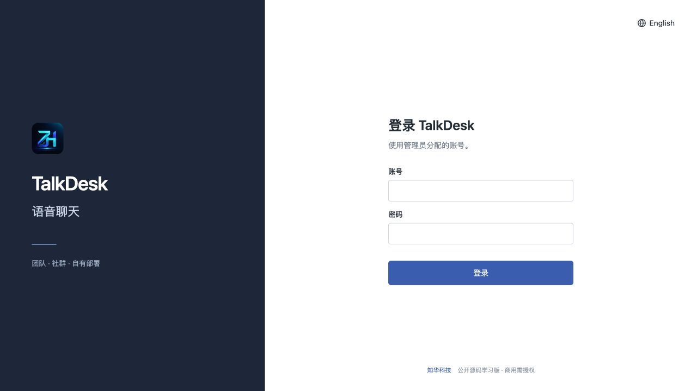

### 成员首页

搜索、筛选、选择房间或使用邀请。

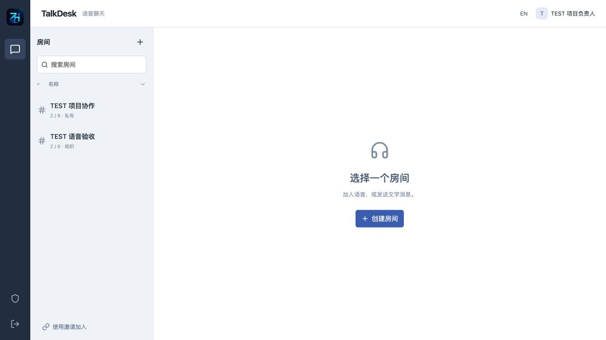

### 持久聊天与成员

真实消息、移除标记和成员管理。

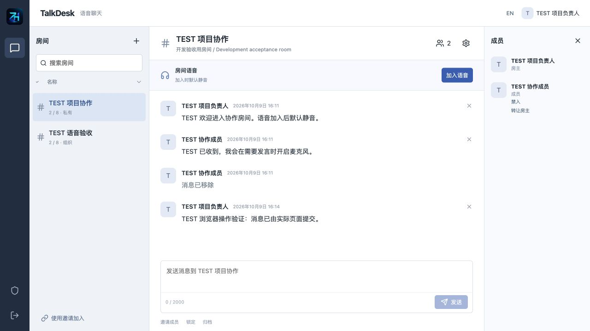

### 房间设置

名称、分类、容量与私有/组织范围。

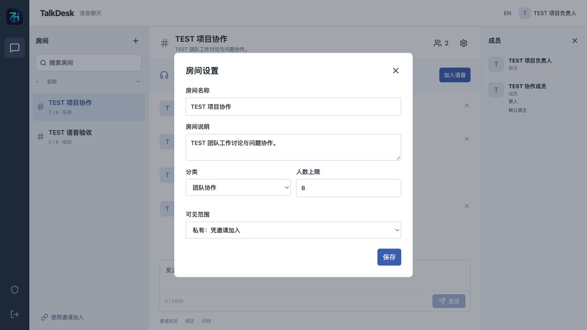

### 邀请管理

实际有效期、限次使用量与撤销，不展示邀请原文。

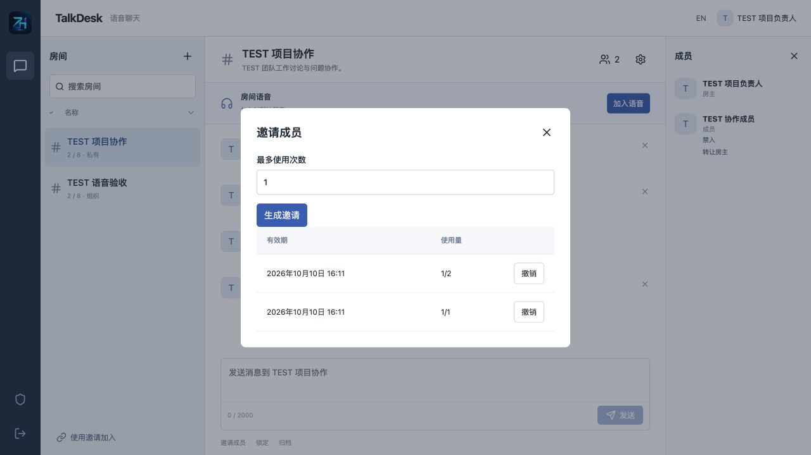

### 实时语音

真实浏览器收听合成测试音，默认静音；不是实际客户会话。

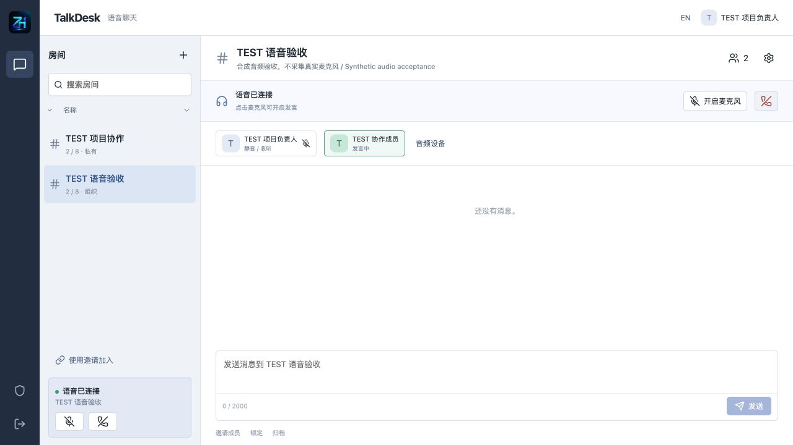

### 音频设备与接收

输入设备、连接方式与实际音频包计数。

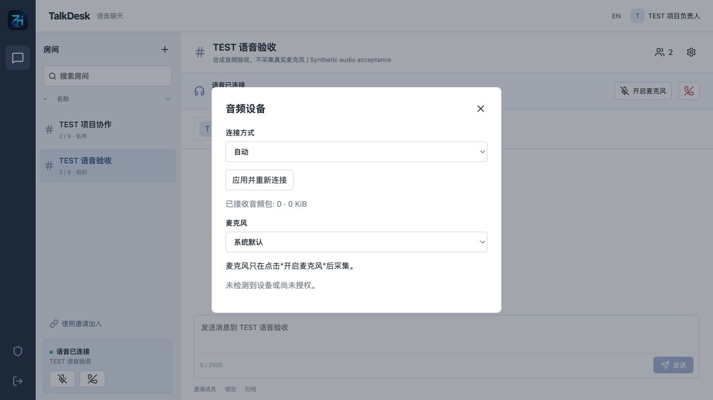

### 登录账号

管理员维护角色、组织及启停。

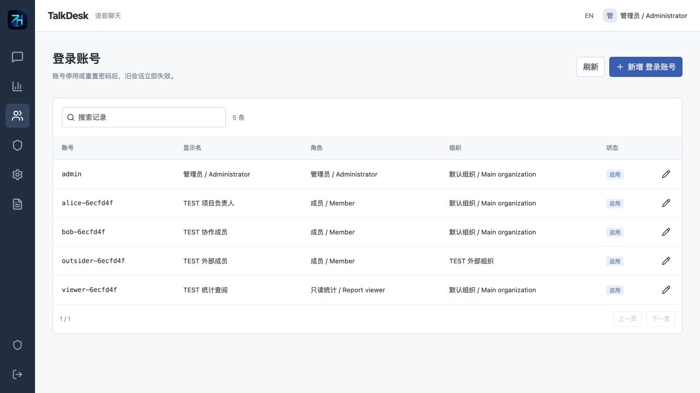

### 角色与权限

成员、组织管理员和统计角色的权限范围。

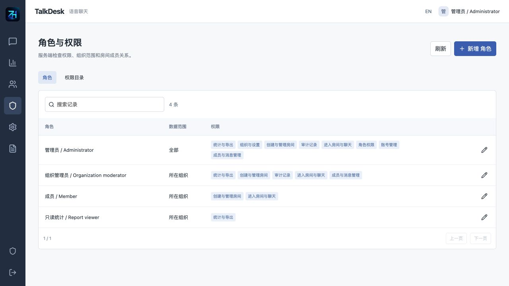

### 组织与设置

组织、时区、字典、参数及菜单。

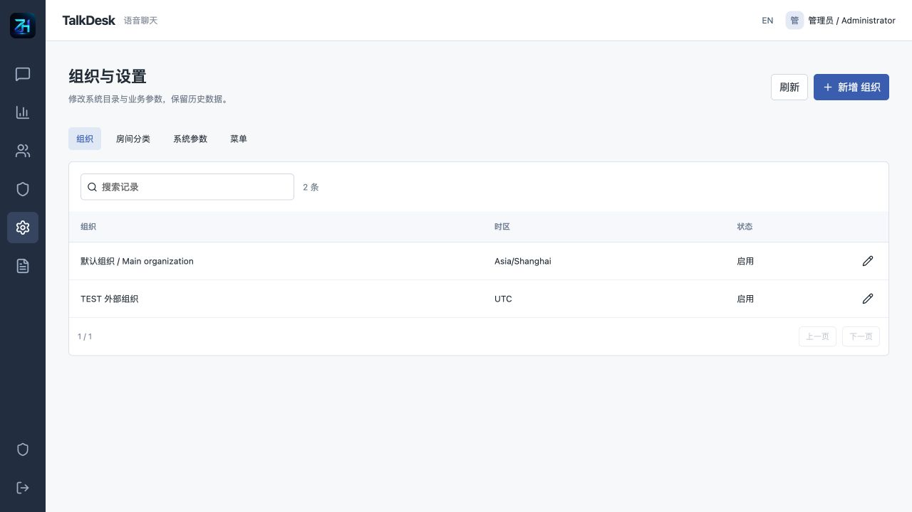

### 使用统计

实际授权范围指标及无正文导出。

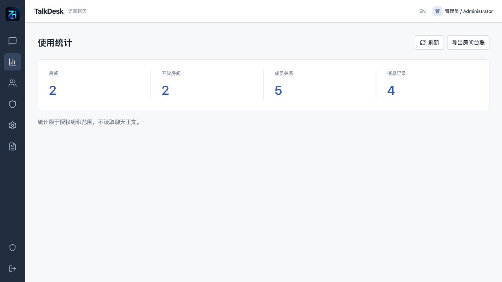

### 操作记录

账号、房间及成员操作审计，不记录密码或消息正文。

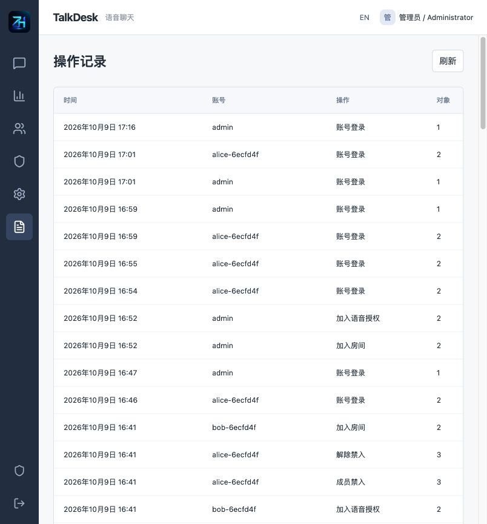

### 英文界面

界面双语切换不翻译或改写聊天内容。

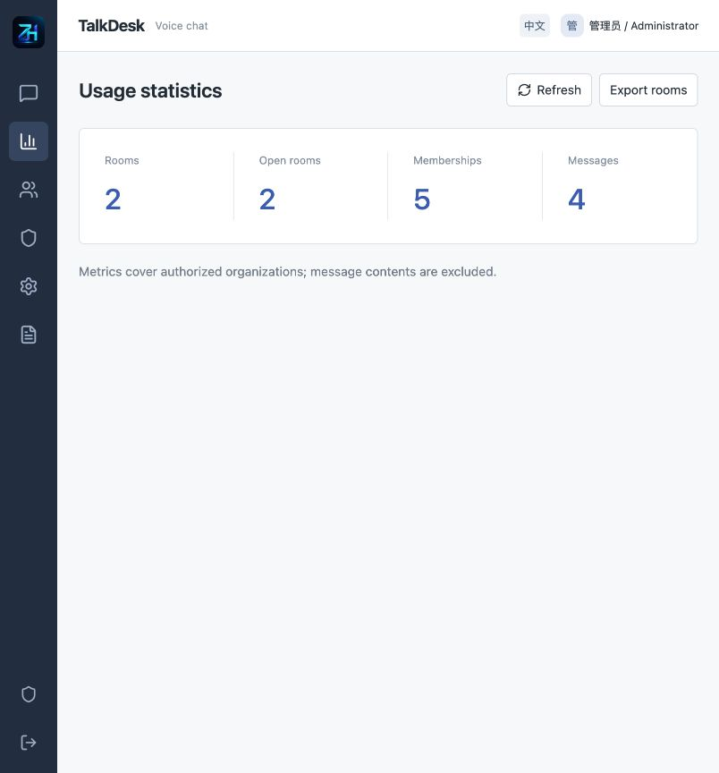

### 手机布局

390×844响应式浏览器布局；不是手机硬件通话验收。

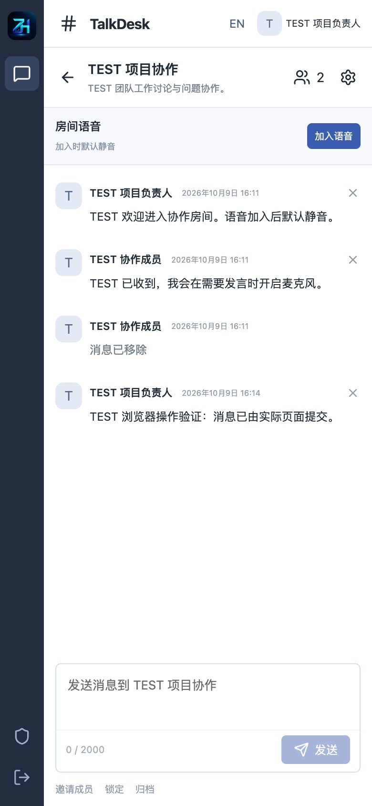

## 架构与目录

Java21、Spring Boot4.0.7、Security、JPA/Hibernate、Flyway；Vue3.5.43、Vite8.1.5、LiveKit Client2.22.3、Lucide；MySQL8.4、LiveKit Server1.13.9、Nginx及Docker Compose。浏览器同源访问 /api 与 /voice，WebSocket经过业务鉴权网关；原生媒体管理端口不公开。房间行锁保证并发加入、邀请使用量及成员容量一致。语音使用已验收的双PeerConnection模式；实际传输采用WebRTC加密，不宣称服务器不可访问的端到端加密。

```text
backend/src/main/java/cn/zhuatech/talkdesk/ # auth, administration, chat, voice gateway
backend/src/main/resources/db/migration/  # V1 identity / V2 chat
backend/src/test/java/                    # HTTP business, concurrency and token tests
frontend/src/                            # member UI, room/voice controls and admin UI
frontend/public/brand/                   # original logo and contact QR images
docs/                                   # user, deployment, API and third-party notes
scripts/                                # configuration, private QA, backup/restore
compose.yaml                            # MySQL, backend, LiveKit and frontend gateway
.env.example                            # configuration names, no credentials
```

## 安装与初始化

需要Docker Engine/Desktop、Compose V2、Python3.10+及至少4GB可用内存；直接源码开发需要JDK21、Maven3.9+、Node.js24.19.0+。首次构建需访问官方依赖仓库。无需已有数据库或付费语音云账号。

```sh
python3 scripts/init-env.py
docker compose -p talkdesk config --quiet
docker compose -p talkdesk up -d --build --wait --wait-timeout 300
```

本机访问 [http://127.0.0.1:8129/](http://127.0.0.1:8129/)，健康检查 [http://127.0.0.1:8129/health](http://127.0.0.1:8129/health)。默认初始化用户名 admin；密码由脚本随机生成到私有 `.env` 的 ADMIN_PASSWORD，仅在本机读取，仓库不提供共享密码。已有 `.env` 不覆盖，已有数据库不重置管理员。首次空库创建角色、组织、菜单、分类和业务参数，不创建聊天。

MySQL结构由V1身份/V2聊天迁移创建，JPA使用validate。数据库及密码、密钥、管理员初始化参数来自环境变量。`.env.example`提供配置名，`runtime/livekit.yaml`是脚本生成的私有媒体配置，二者中的真实值均不得提交。

## 配置、源码启动与部署

- WEB_PORT / BIND_ADDRESS：默认8129与回环，可覆盖端口，不能为本机测试停止其他项目。
- RTC_NODE_IP / RTC_BIND_ADDRESS：客户端可达媒体地址/本机监听地址；回环只用于同机测试。其他设备要填写实际服务器地址并使用可信HTTPS。
- RTC_TCP_PORT / RTC_UDP_PORT：默认7891/7892；TURN_UDP_PORT默认7893，中继UDP范围默认7900–7910。按人数扩展范围，修改后备份自定义配置后以 --render 重新运行配置脚本。
- LIVEKIT_API_KEY / LIVEKIT_API_SECRET：自部署媒体签名凭据，secret至少32字符，不是必须购买的云API。
- MYSQL_ROOT_PASSWORD / DATABASE_PASSWORD：独立强密码；ADMIN_USERNAME / ADMIN_PASSWORD只用于空库首次初始化；COOKIE_SECURE在HTTPS环境设true。
- LIVEKIT_CONFIG_PATH：runtime内独立配置路径。不得直接开放LiveKit7880、后台8080、Twirp管理接口或数据库。

源码开发可在backend目录运行 `mvn spring-boot:run`，需显式配置DATABASE_URL/USER/PASSWORD、ADMIN_PASSWORD、LIVEKIT_API_KEY/SECRET及LIVEKIT_INTERNAL_URL；同时运行自部署媒体服务。前端 `npm ci && npm run dev` 代理业务端点到本机8080；完整语音建议使用Compose的鉴权网关，不能用无鉴权开发代理替代正式网关。

生产HTTPS、媒体端口、NAT、TURN策略、数据库升级和备份恢复操作见 [部署说明](docs/DEPLOYMENT.md)。内置TURN/UDP可独立部署；本机强制中继需要实际可达网卡地址，Docker私网目标仅允许本实例精确SFU地址。TURN/TLS证书与端口需部署者配置，当前不自动申请证书。手机麦克风需安全上下文，不能把非localhost的HTTP当成可用手机部署。

## 测试

```sh
# backend directory
mvn spotless:check test
# frontend directory
npm ci
npm run format:check
npm run lint
npm test
npm run build
# repository root, disposable empty instance only
python3 -m venv .venv
.venv/bin/pip install -r scripts/requirements-quality.txt
.venv/bin/python scripts/quality.py
.venv/bin/python scripts/verify-media.py
```

后端54项（42项真实身份/迁移/HTTP/权限/并发测试，12项签名/外部媒体协议测试），前端8项请求与会话行为测试。媒体服务外部调用仅在后端隔离测试使用替身；实际MySQL/LiveKit验收另外执行真实接口和两个独立RTC客户端双向合成音频，并测试禁入后断开及旧票据拒绝。`TALKDESK_RELAY_TEST=1`可强制中继验收，但必须先配置客户端可达的实际服务器地址和中继端口。

`quality.py`只用于全新一次性数据库，创建明确标注TEST的账号、房间和消息，并生成不提交的private-quality-state.json。不在正式客户数据库运行。浏览器接收验收可运行verify-browser-audio.py，发送45秒合成测试音；不等同于真实麦克风、手机听感或公网压力测试。备份恢复及持久化核对见部署说明与verify-persistence.py。

配置脚本另有4项保护测试：`python3 scripts/test-config.py`，验证私有文件权限、已有凭据不覆盖、自定义配置保留及无效地址拒绝。

## 限制与故障处理

- 当前是单后台、单SFU部署的学习源码，没有消息附件、私聊/好友、视频、屏幕共享、录音、转写、AI聊天、电话拨号、陌生人匹配或打赏。
- 默认房间最多16个成员，可将配置上限调整到32；这是程序约束，不是已验证32人并发音频或生产SLA。目录列表最多10000行，消息按50条读取；实时文字采用3秒轮询，没有已完成的集群扩容或推送网关。
- MySQL保存账号散列、成员、邀请摘要及消息正文；音频不录制。TLS/SRTP传输不是应用层端到端加密，部署者对服务器数据安全和合法处理负责。
- 已验收本机/实际私有网卡的合成音频、浏览器收听和响应式布局；未验收真实手机硬件、多运营商公网、长期高并发、跨国网络或生产客户使用。不宣称生产可直接运营。
- 文字可用但语音失败：检查媒体服务、实际可达地址、媒体端口和TURN；默认回环不是外网地址。没有麦克风/拒绝权限：可继续收听，核对设备及站点权限。服务重建后重新加入，切勿关闭证书验证或绕过业务网关。
- 网络中断提交结果未知：刷新核对后再决定重发。会话失效：重新登录。版本冲突：刷新核对当前资料。完整操作见 [用户手册](docs/USER_GUIDE.md)，接口见 [API说明](docs/API.md)。

## 授权、反馈与联系知华科技

本项目由知华科技（上海如静知华信息科技有限公司）提供公开源码学习版本，主要用于个人学习、技术研究与非商业交流。未经书面授权不得商用。企业信息化建设、中小企业数字化转型、中小企业 AI 转型、私有化部署、软件外包、软件项目外包、软件实施、FDE 外包、OPC 技术支持及深度定制开发，请访问知华科技官网 [https://www.zhuatech.cn/](https://www.zhuatech.cn/)，或添加微信 zhuatech、zhuatech2 咨询。

商业授权或深度定制开发请联系知华科技。根目录LICENSE约束自有代码；第三方原许可及版权见 [第三方说明](docs/THIRD_PARTY.md)。软件按现状提供，实际部署者应自行核对业务适用法规、备案和许可；源码采购不包含这些资质。

贡献前先阅读非商业许可，提交可复现的问题和测试，不提交客户聊天、邀请码、密码、令牌、密钥或私有备份。一般问题可通过仓库Issues或官网反馈；安全漏洞请通过官网或微信私下联系，不在公开Issue张贴可利用细节和敏感数据。

<table><tr><td align="center"><br>微信：zhuatech</td><td align="center"><br>微信：zhuatech2</td></tr></table>
